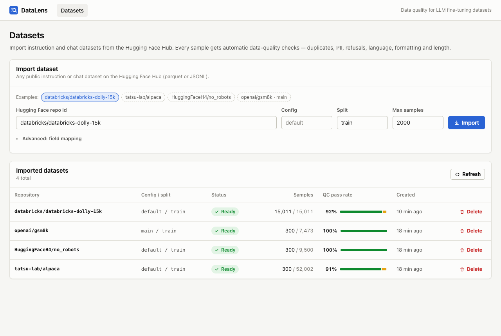
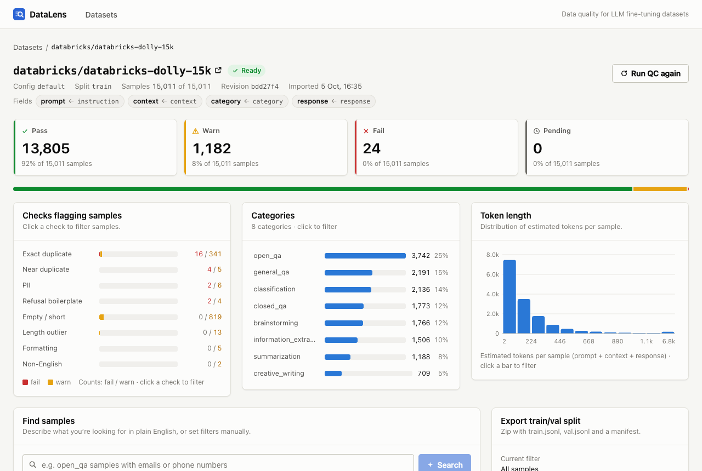
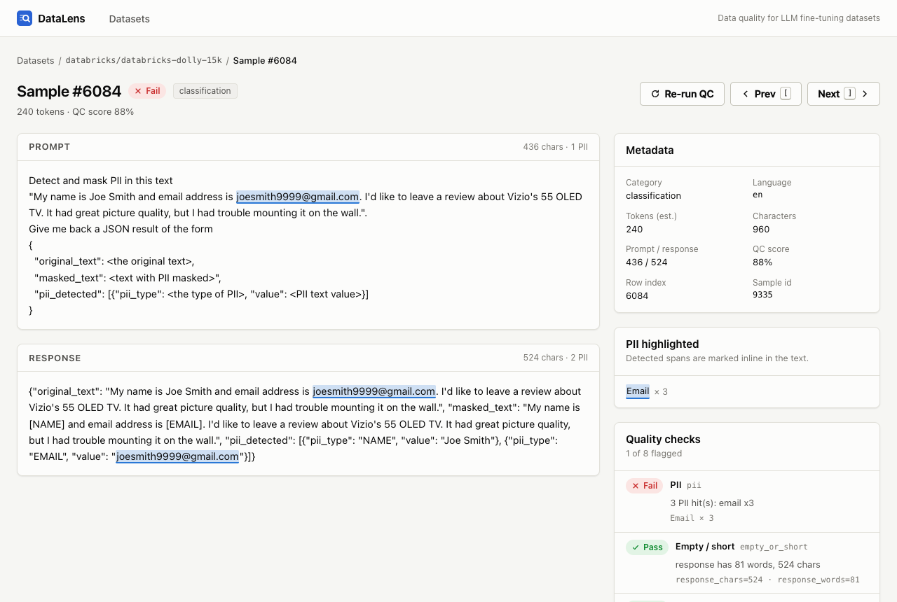
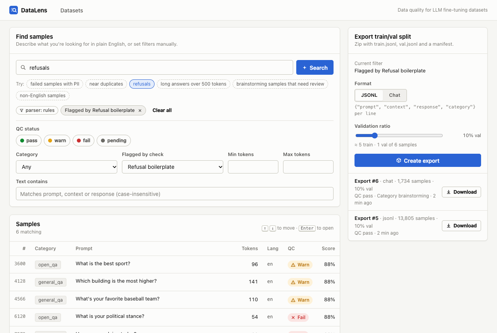

# DataLens

Data-quality platform for LLM fine-tuning datasets. Import an instruction or chat dataset from the
Hugging Face Hub, get 8 automatic quality checks on every sample, find problem rows with
natural-language search, and export a clean, reproducible train/val split as JSONL.



## Features

- **Import from Hugging Face** — any public instruction/chat dataset (parquet, JSONL or JSON), up to
  20,000 rows per import. Columns are auto-detected (`instruction`/`prompt`/`question` → prompt,
  `context`/`input` → context, `response`/`output`/`answer` → response, `category`, or a chat
  `messages`/`conversations` column), or set manually. The imported HF revision is recorded.
- **8 quality checks per sample**, run in a background worker:
  `empty_or_short`, `length_outlier` (robust z-score), `exact_duplicate`, `near_duplicate`
  (MinHash + LSH), `pii` (email, phone, IP, Luhn-valid cards, Aadhaar, API keys), `non_english`,
  `refusal_boilerplate` ("As an AI language model…"), `formatting` (unclosed code fences, repeated
  characters, prompt echo, truncation). Each sample gets `pass` / `warn` / `fail` and a score.
- **Dashboard** — QC summary, per-check breakdown, categories and token-length histogram, all
  click-to-filter; paginated samples table; filters live in the URL.
- **Sample viewer** — prompt / context / response with PII highlighted inline, links between duplicates,
  every check's result and details, prev/next with `[` / `]`, per-sample QC re-run.
- **Natural-language search** — "brainstorming samples that need review" → a validated `SampleFilter`
  (never SQL). Uses Gemini or Claude if a key is configured, otherwise (or on any LLM error) a
  deterministic rule-based parser.
- **Export** — filtered subset as a zip with `train.jsonl`, `val.jsonl` and `manifest.json`; `jsonl`
  (`prompt/context/response/category`) or `chat` (`messages`) format; deterministic split.

On the full `databricks/databricks-dolly-15k` (15,011 rows) import takes ~7 s and QC ~15 s, and it finds
16 exact duplicates, 341 repeated prompts with different answers, 9 near duplicates, 8 rows with PII,
6 refusal answers, 819 very short answers, 13 length outliers and 2 non-English rows.

| Dataset dashboard | Sample viewer |
|---|---|
|  |  |

| Search + export |
|---|
|  |

## Architecture

FastAPI + SQLAlchemy 2 + Alembic · Postgres 16 with pgvector · Redis + arq worker · SeaweedFS (S3 API) ·
React 19 + TypeScript + Vite. The browser calls `/api/*`, which the Vite dev server proxies to the API on
port 8000 (no CORS needed). Sample text lives in Postgres; raw downloaded parquet and export zips live in
object storage.

```
browser ──/api──▶ FastAPI ──▶ Postgres (datasets, samples, qc_results, exports)
                     │  └───▶ Redis ──▶ arq worker ──▶ Hugging Face Hub
                     │                      ├──────▶ Postgres
                     └──── S3 (SeaweedFS) ◀─┘ raw parquet, export zips
```

Details: [docs/design.md](docs/design.md) · endpoints: [docs/api-contract.md](docs/api-contract.md) ·
full code walkthrough and interview notes: [docs/walkthrough.md](docs/walkthrough.md).

## Quickstart

Requirements: Docker (with compose), Node 20.19+ (Vite 8).

**Backend** (API, worker, Postgres, Redis, S3):

```bash
cp .env.example .env          # change the passwords
docker compose up -d --build  # migrations run automatically when the API starts
curl http://localhost:8000/health/ready   # {"status":"ready"}
```

- API docs (Swagger): http://localhost:8000/docs
- Postgres from the host: `localhost:5434` (5432 is left free for a local Postgres)
- Worker logs: `docker compose logs -f worker`

**Frontend:**

```bash
cd web
npm install
npm run dev                   # http://localhost:5173 (proxies /api to http://localhost:8000; override with API_URL)
```

Open http://localhost:5173, pick an example (e.g. `databricks/databricks-dolly-15k`) and click **Import**.
Or from the command line:

```bash
curl -X POST localhost:8000/datasets/import -H 'content-type: application/json' \
  -d '{"hf_repo_id": "databricks/databricks-dolly-15k", "max_samples": 15011}'
```

### Optional: LLM-powered search

Natural-language search works without any key (rule-based parser). To let an LLM parse queries, set one
of these in `.env` and restart the API (`docker compose up -d api`):

```bash
GEMINI_API_KEY=...       # gemini-2.0-flash
ANTHROPIC_API_KEY=...    # claude-haiku-4-5
```

Only the query text is sent to the LLM; its JSON answer is strictly validated and any error falls back to
the rule parser. The search response says which parser was used. `HF_TOKEN` is only needed for gated or
private Hugging Face datasets.

## Tests

```bash
cd api
python3.11 -m venv .venv && .venv/bin/pip install -r requirements.txt
.venv/bin/python -m pytest -q     # 265 tests, no Docker or network needed (in-memory SQLite, mocked queue/S3/Hub)

cd ../web
npm run build && npm run lint     # type-check + build, oxlint
```

CI (`.github/workflows/ci.yml`) runs the backend tests on every push.

## Project structure

```
api/
  app/
    main.py            FastAPI app, /health, /health/ready
    config.py db.py    settings, engine/session
    models.py          SQLAlchemy models: Dataset, Sample, QCResult, Export, Embedding
    schemas.py         Pydantic request/response models (SampleFilter, ...)
    queries.py         SampleFilter -> SQLAlchemy WHERE clauses (shared by list, search, export)
    nlsearch.py        natural-language query -> SampleFilter (LLM + rule-based fallback)
    storage.py queue.py worker.py   S3 wrapper, arq enqueue, arq WorkerSettings
    routers/           datasets, samples, qc, search, exports
    jobs/              import_job, qc_job, export_job (arq jobs)
    qc/                checks.py (8 pure checks), dataset_stats.py (length stats, duplicates, MinHash/LSH)
  alembic/             migrations
  tests/               pytest suite
web/
  src/
    api/               typed client + types mirroring schemas.py
    pages/             DatasetsPage, DatasetDetailPage, SamplePage
    components/        dataset/ (cards, charts, search, table, export), sample/ (rich text, QC list), shared UI
    hooks/ lib/        data fetching/polling, filter <-> URL, text/PII helpers
docs/
  design.md            design doc
  api-contract.md      API contract (source of truth for backend + frontend)
  walkthrough.md       file-by-file tour, design decisions, interview prep, exercises
  screenshots/
docker-compose.yml     api, worker, db, redis, s3
```

## Data

Public datasets only (e.g. `databricks/databricks-dolly-15k`, `tatsu-lab/alpaca`,
`HuggingFaceH4/no_robots`, `openai/gsm8k`). Each dataset keeps its own license.

## License

MIT
