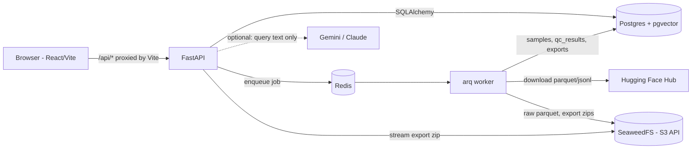

# DataLens — Design Doc

## Problem
Fine-tuning an LLM is only as good as the instruction/chat data it is trained on. Public datasets
such as `databricks/databricks-dolly-15k`, `tatsu-lab/alpaca` or `HuggingFaceH4/no_robots` contain
exact and near duplicates, canned "As an AI language model…" refusals, personal data (emails, phone
numbers, keys), non-English rows, one-word answers, truncated or badly formatted responses and extreme
length outliers. These rows waste compute, teach the model bad habits (refusals, boilerplate), leak
PII into weights, and inflate eval scores when duplicates cross the train/val boundary. Today people
find them with ad-hoc notebooks, one dataset at a time, and rarely look at the actual rows.

## Users
ML / AI engineers preparing supervised fine-tuning (SFT) data. They want to (a) pull a dataset from
the Hugging Face Hub, (b) see at a glance what is wrong with it, (c) drill into individual samples and
(d) export a clean, reproducible train/val split in a format their trainer accepts.

## Goals
- Import any public instruction or chat dataset from the Hub (parquet or JSON/JSONL), auto-detecting
  the prompt / context / response / category / messages columns.
- Run 8 automatic quality checks on every sample in a background worker; store per-check results.
- Dashboard: QC counts, per-check breakdown, categories, token-length histogram, all click-to-filter.
- Sample viewer with inline PII highlights and links between duplicates.
- Natural-language search ("near duplicates in brainstorming") that is safe: the query becomes a
  validated filter object, never SQL.
- Export a filtered subset as a deterministic train/val split (`jsonl` or `chat` format) in a zip with
  a manifest that records source revision, filter and counts.

## Non-goals
- Training or evaluating models.
- Editing / relabelling samples in place (DataLens filters; it does not rewrite data).
- Multi-tenant auth, billing, or horizontal scaling (single-node docker compose; see "Scaling").
- Proprietary data — public datasets only.

## Architecture



- **API** (`api/app/main.py`, `routers/`): validates input with Pydantic, reads/writes Postgres,
  enqueues jobs and returns `202` for long work. Runs `alembic upgrade head` on start.
- **Worker** (`app/worker.py`, `app/jobs/`): arq jobs `import_dataset`, `run_dataset_qc`,
  `run_sample_qc`, `build_export`. Blocking work runs in `asyncio.to_thread`.
- **Postgres**: all metadata *and* sample text (it is small: dolly-15k is ~11 MB of text).
- **Object storage** (SeaweedFS, S3 API): raw downloaded parquet (`datasets/{id}/raw/{n}.parquet`)
  for provenance, and export zips (`exports/{id}.zip`).
- **Web** (`web/`): React 19 + TypeScript + Vite; the dev server proxies `/api` to the API.

## Data model

| Table | Key columns |
|---|---|
| `datasets` | `hf_repo_id`, `config`, `split` (unique together), `revision` (HF commit imported), `fields` (column mapping used, JSONB), `num_samples`, `total_samples`, `status` (`pending → importing → ready \| failed`), `error` |
| `samples` | `dataset_id` (FK, cascade), `sample_index` (row number, unique per dataset), `prompt`, `context`, `response`, `category`, `prompt_chars`, `response_chars`, `tokens_est` (≈ chars / 4), `lang`, `content_hash` (sha1 of normalised text), `qc_status` (`pending\|pass\|warn\|fail`), `qc_score` (share of checks passed) |
| `qc_results` | `sample_id` (FK, cascade), `check_name`, `passed`, `severity`, `message`, `details` (JSONB: PII spans, duplicate ids, z-scores…) |
| `exports` | `dataset_id`, `filter` (JSONB SampleFilter), `val_ratio`, `format` (`jsonl\|chat`), `status`, `num_samples`, `s3_key` |
| `embeddings` | `sample_id` (unique), `model`, `embedding vector(384)` — reserved for semantic search / dedup |

Indexes: `samples(dataset_id)`, `samples(qc_status)`, `samples(category)`, `samples(content_hash)`,
`qc_results(sample_id)`, `qc_results(check_name)`, `exports(dataset_id)`.

## Quality checks
Every check is a pure function in `app/qc/checks.py` (strings/numbers in, `CheckResult` out). Dataset-wide
inputs (length distribution, duplicate groups, near-duplicate pairs) are computed once per dataset in
`app/qc/dataset_stats.py`. A sample's `qc_status` is its worst severity.

| Check | Warn | Fail |
|---|---|---|
| `empty_or_short` | response < 3 words or < 15 chars | prompt or response empty |
| `length_outlier` | robust z of `log1p(tokens)` > 3.0 (median/MAD; IQR fallback; skipped < 20 samples) | z > 4.5 |
| `exact_duplicate` | same normalised prompt(+context) with a different response | same content hash as an earlier sample |
| `near_duplicate` | MinHash/LSH candidate, verified word-5-shingle Jaccard ≥ 0.85 with an earlier sample (and responses share ≥ 50% of words) | Jaccard ≥ 0.95 (and not already an exact duplicate) |
| `pii` | 1–2 hits: email, phone (IN / intl / NA), IPv4 | ≥ 3 hits, or any credit card (Luhn), Aadhaar, or secret/API key |
| `non_english` | non-Latin script (< 70% ASCII letters) or foreign function words dominate; code is skipped | — |
| `refusal_boilerplate` | refusal / "as an AI" phrase in a long answer, or unprompted self-reference to OpenAI/ChatGPT | response ≤ 60 words that is mostly a refusal |
| `formatting` | one of: unbalanced ``` fence, unbalanced brackets in code, 20+ repeated chars, response echoes the prompt, truncated mid-sentence | two or more issues |

Only the *later* copy of a duplicate is flagged, so filtering out `exact_duplicate` / `near_duplicate`
keeps exactly one copy. On full dolly-15k (15,011 rows) QC takes ~11–18 s and finds 357 exact-duplicate
/ same-prompt rows, 9 near duplicates, 8 PII rows, 6 refusals, 819 very short answers and 2 non-English
rows.

## Natural-language search
`POST /search {query, dataset_id}` turns text into a `SampleFilter`
(`qc_status[]`, `category`, `lang`, `min_tokens`, `max_tokens`, `text_contains`, `failed_check`):

1. If `GEMINI_API_KEY` or `ANTHROPIC_API_KEY` is set, an LLM gets a prompt with the filter schema, the
   allowed check/category/status values and four few-shot examples, and must return JSON only.
2. The JSON is validated strictly (`validate_llm_filter`): unknown keys, unknown check names,
   non-numeric or negative token bounds, `min > max`, or a bad `lang` reject the whole answer.
3. Any LLM error, timeout (10 s) or invalid output falls back to a deterministic rule parser
   (`parse_rules`: regexes for quoted text, token/word/char bounds, check phrases with negation, status
   words, categories, language). With no key, the rule parser is used directly.
4. The filter is applied by `queries.apply_sample_filter` with SQLAlchemy expressions (bound parameters).

**Why filter-JSON, not text-to-SQL:** the LLM can only choose values for a small, typed schema, so it
cannot read other tables, drop data or write a slow cartesian join; prompt-injection in the query has
nothing dangerous to reach. Validation is cheap and testable without the LLM, the UI can show the
parsed filter as removable chips, and the same `SampleFilter` drives the samples list, search and
export. Only the query text is sent to the LLM, never dataset contents.

## Export formats
`POST /exports {dataset_id, filter, val_ratio, format}` → worker streams matching rows (in
`sample_index` order, 1,000 per batch) into a zip:

- `manifest.json`: generator, export id, source `{hf_repo_id, config, split, revision}`, field mapping,
  filter, format, val ratio, counts, created_at.
- `train.jsonl`, `val.jsonl`:
  - `jsonl`: `{"prompt", "context", "response", "category"}` per line
  - `chat`: `{"messages": [{"role": "user", ...}, {"role": "assistant", ...}]}` (context appended to the user turn)

The split is deterministic: sorted sample ids shuffled with `random.Random(export_id)`; at least one
train and (when n ≥ 2 and ratio > 0) one val sample.

## Failure handling
- Jobs are idempotent: an import deletes the dataset's samples and raw objects before re-reading; a
  dataset QC run replaces all its `qc_results`. A worker killed mid-job (arq re-queues it on restart)
  therefore converges to the same state.
- User-facing import errors (bad config/split, no usable columns) are stored in `datasets.error`.
- One bad sample cannot kill a QC run: it gets a single `qc_error` fail result.
- Unique `(hf_repo_id, config, split)` + a pre-check gives `409` on duplicate import, even under a race.

## Scaling notes
Current design comfortably handles ~10⁵ samples per dataset on one machine. Toward 10⁷:
- **QC**: shard by sample-id range; exact duplicates via `GROUP BY content_hash`; MinHash signatures
  stored per sample so LSH bands can be joined in SQL or a dedicated index; process in streaming chunks
  instead of loading all rows.
- **Storage**: move sample text to parquet in object storage and keep only metadata + derived columns in
  Postgres; partition `samples` / `qc_results` by `dataset_id`.
- **Queries**: composite indexes such as `(dataset_id, qc_status, sample_index)`, a trigram (`pg_trgm`)
  GIN index for `text_contains`, a denormalised `flags` bitmask instead of the `EXISTS` on `qc_results`,
  keyset pagination instead of `OFFSET`, approximate counts.
- **Workers**: more arq workers (stateless), per-job progress in Redis, export via server-side cursors
  straight into a multipart S3 upload.
- **Semantic dedup**: fill `embeddings` with a small sentence model and use pgvector HNSW for
  paraphrase-level duplicates.
