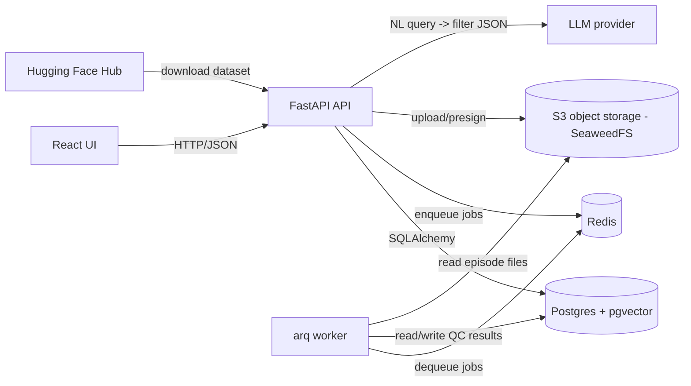

# EpisodeHub — Design Doc

## Problem
Robot-learning teams train policies on recorded demonstration episodes (camera video + joint states + actions). Open datasets such as Hugging Face LeRobot (`lerobot/pusht`, `lerobot/aloha_*`) contain hundreds to thousands of episodes, and some of them are broken: dropped frames, timestamp gaps, joint spikes, truncated runs. Today people find these by hand, after a training run has already gone wrong.

## Users
ML engineers and researchers on robot-learning teams who need to (a) import a dataset, (b) find bad episodes before training, and (c) pull out subsets ("short pushes that ended near the target") without writing ad-hoc scripts.

## Goals
- Import a LeRobot-format dataset from Hugging Face: metadata into Postgres, video/parquet files into object storage.
- Run quality checks per episode as background jobs and store the results.
- Browse datasets and episodes with their QC status in a web UI.
- Search episodes in natural language, safely.
- Export a filtered episode list (JSON/CSV).

## Non-goals
- Training models or running policies.
- Recording data from real robots.
- Multi-tenant auth, billing, or horizontal scaling.
- Any proprietary or company data — public open datasets only.

## Architecture

The API and worker share one codebase and Docker image; the worker just runs `arq app.worker.WorkerSettings`.

## Data model

| Table | Key columns |
|---|---|
| `datasets` | `id`, `hf_repo_id` (unique, e.g. `lerobot/pusht`), `name`, `fps`, `robot_type`, `num_episodes`, `status` (`importing`/`ready`/`failed`), `created_at` |
| `episodes` | `id`, `dataset_id` → datasets, `episode_index`, `length_frames`, `duration_s`, `task`, `video_key` (object path in S3 storage), `qc_status` (`pending`/`pass`/`warn`/`fail`), `created_at` |
| `qc_results` | `id`, `episode_id` → episodes, `check_name`, `passed`, `severity`, `details` (JSONB), `created_at` |
| `embeddings` | `id`, `episode_id` → episodes (unique), `model`, `text` (what was embedded), `embedding` (pgvector `vector(N)`), `created_at` |

## API

| Method | Path | Purpose |
|---|---|---|
| GET | `/health` | Liveness, no dependencies |
| GET | `/health/ready` | Readiness, checks DB |
| POST | `/datasets/import` | Import a HF dataset by repo id |
| GET | `/datasets` | List datasets |
| GET | `/datasets/{id}` | Dataset detail + QC summary |
| GET | `/datasets/{id}/episodes` | Paginated episodes, filterable by `qc_status`, length |
| GET | `/episodes/{id}` | Episode detail, QC results, presigned video URL |
| POST | `/datasets/{id}/qc` | Enqueue QC jobs for all episodes |
| POST | `/search` | NL query → filter JSON → results |
| GET | `/datasets/{id}/export` | Export filtered episode list (CSV/JSON) |

## QC checks
Each check is a pure function `(episode data) -> QCResult` so it is easy to unit-test.
1. **Timestamp gaps** — any consecutive frame delta > 1.5 × (1/fps).
2. **Dropped frames** — frame count vs. `duration × fps` mismatch.
3. **Frozen frames** — N consecutive identical (or near-identical) video frames / state vectors.
4. **Joint-limit violations** — state values outside the dataset's observed min/max (or configured limits).
5. **Velocity spikes** — per-joint |Δstate / Δt| above a z-score threshold.
6. **Episode-length outliers** — length outside median ± 3 × MAD for the dataset.

## Natural-language search
1. User types: "failed episodes shorter than 5 seconds with velocity spikes".
2. The LLM is given a fixed JSON schema (a Pydantic model) of allowed filters, e.g. `{"qc_status": "fail", "max_duration_s": 5, "failed_checks": ["velocity_spike"], "semantic_text": null}`.
3. The API validates the JSON with Pydantic and builds the SQL with SQLAlchemy (parameterised). Any free-text part (`semantic_text`) is embedded and ranked with pgvector cosine distance.

**Why filter JSON instead of raw SQL:** the LLM never touches the database directly. Raw generated SQL could be wrong, slow, or malicious (prompt injection → `DROP TABLE`). A validated schema limits the LLM to filters we explicitly support, makes bad output fail loudly at validation, and makes the feature unit-testable without an LLM (test JSON → SQL separately).

## Build order
- **Week 2** — Foundation: compose stack, models, health checks, CI (this commit).
- **Week 3** — Import: `POST /datasets/import`, `GET /datasets`, Alembic migrations.
- **Week 4** — QC workers: the six checks, arq jobs, `qc_results` stored.
- **Week 5** — React UI: datasets list, episodes table with QC badges, episode detail with video.
- **Week 6** — NL search + export: LLM → filter JSON → SQL, pgvector embeddings, CSV/JSON export.
- **Week 7** — Tests, CI, deploy, README, demo video.
