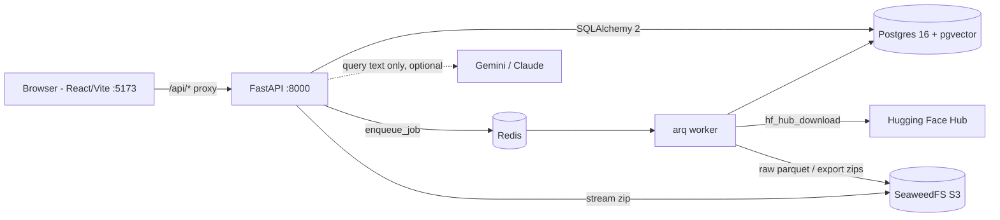
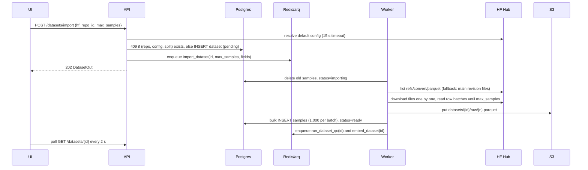
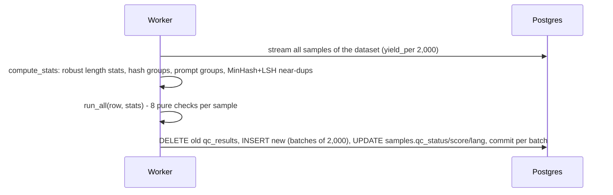
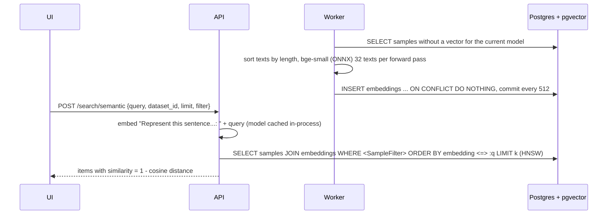

# DataLens — Code Walkthrough & Interview Guide

This document is for the owner of the project: how it works end to end, why it is built this way, and
how to talk about it in Software Engineer and AI Engineer interviews. Read it with the code open.
Related docs: [design.md](design.md) (design doc), [api-contract.md](api-contract.md) (every endpoint).

---

## 1. What DataLens does

**In three sentences.** DataLens imports instruction and chat datasets used for LLM fine-tuning straight
from the Hugging Face Hub and runs eight automatic quality checks on every sample (empty/short answers,
length outliers, exact and near duplicates, PII, non-English text, refusal boilerplate, formatting). A
React dashboard shows what is wrong with the dataset, lets you open any sample with PII highlighted and
duplicates linked, and lets you search in plain English ("brainstorming samples that need review"),
which an LLM — or a rule-based fallback — turns into a validated filter. You then export the clean subset
as a deterministic train/val split in JSONL or chat format, with a manifest recording exactly where the
data came from.

**Why data quality matters for fine-tuning.**
- *Garbage in, garbage out is amplified.* SFT datasets are small (thousands of rows), so every bad row has
  a large effect. A few hundred "As an AI language model, I cannot…" responses teach the model to refuse.
- *Duplicates distort training and evaluation.* Exact copies are over-weighted (the model memorises them),
  and a duplicate that lands in both train and val makes validation loss look better than it is.
- *PII leaks into weights.* Models can regurgitate emails, phone numbers and API keys seen in training.
- *Length and format.* One-word answers teach terse behaviour; truncated answers teach the model to stop
  mid-sentence; extreme outliers waste context window and dominate loss.
- *Language mix.* A stray foreign-language row in an English SFT set is noise.
- Industry evidence: the LIMA paper ("Less Is More for Alignment") showed 1,000 carefully curated
  examples can beat much larger noisy sets — curation is worth more than volume.

On the full `databricks/databricks-dolly-15k` (15,011 rows) DataLens finds 16 exact duplicates
(e.g. "Why is the sky blue?" appears twice with the same answer), 341 "same prompt, different answer"
rows, 9 near duplicates, 8 rows with PII (a "detect and mask PII" task that contains a real-looking
email three times), 6 refusal/AI-boilerplate answers ("What is your political stance?" → "As an AI
model…"), 819 very short answers, 13 length outliers (a 4,232-token article vs a median of 114) and 2
non-English rows ("Quel a été l'impact de la révolution française ?"). Import takes ~7 s and QC ~11–18 s.

---

## 2. Architecture and request flows



Five docker-compose services (`docker-compose.yml`, project `datalens`): `api`, `worker` (same image,
different command), `db` (pgvector/pgvector:pg16, host port 5434), `redis`, `s3` (SeaweedFS). The web
app runs on the host with `npm run dev`; Vite proxies `/api/*` to the API so there is no CORS.

### Import flow


### QC flow

`POST /datasets/{id}/qc` first sets every sample to `pending`, then enqueues the job; the UI polls
`/qc/summary` while `pending > 0`.

### Search flow
```mermaid
sequenceDiagram
    participant UI
    participant API
    participant LLM
    participant DB
    UI->>API: POST /search {query, dataset_id}
    alt API key configured
        API->>LLM: schema + rules + few-shot + query (temperature 0, 10 s timeout)
        LLM-->>API: JSON
        API->>API: validate_llm_filter (reject on anything unexpected)
    end
    API->>API: on no key / error / invalid -> parse_rules(query)
    API->>DB: resolve category spelling; apply_sample_filter -> SELECT ... LIMIT
    API-->>UI: {filter, parser, items, total}
    UI->>UI: write filter into the URL; chips + samples table update
```

### Semantic search flow

The sample viewer calls `GET /samples/{id}/similar`, which reuses the stored vector of that sample.

### Export flow
```mermaid
sequenceDiagram
    participant UI
    participant API
    participant W as Worker
    participant DB
    participant S3
    UI->>API: POST /exports {dataset_id, filter, val_ratio, format}
    API->>DB: INSERT export (pending); enqueue build_export
    W->>DB: SELECT matching ids -> deterministic split (Random(export_id))
    W->>DB: stream rows (yield_per 1,000) -> train.jsonl / val.jsonl on disk
    W->>S3: upload exports/{id}.zip (manifest + both files)
    W->>DB: status=ready, num_samples
    UI->>API: poll GET /exports?dataset_id=; GET /exports/{id}/download (streamed from S3)
```

---

## 3. File-by-file tour

### Backend — `api/app/`

| File | Purpose | Key functions / design reasons |
|---|---|---|
| `config.py` | Settings from env (`.env`) via pydantic-settings | `get_settings()` is `lru_cache`d. Defaults point at localhost so tests can import the app without Docker. |
| `db.py` | Engine, `SessionLocal`, `Base`, `get_db` | Engine creation is lazy (no connection at import). `get_db` is a FastAPI dependency: one session per request, always closed. `pool_pre_ping` survives DB restarts. |
| `models.py` | SQLAlchemy 2 typed models: `Dataset`, `Sample`, `QCResult`, `Export`, `Embedding` | `JSONType` = JSON on SQLite, JSONB on Postgres, so tests run on in-memory SQLite. All FKs `ON DELETE CASCADE` so deleting a dataset is one statement. Unique `(hf_repo_id, config, split)` and `(dataset_id, sample_index)`. |
| `schemas.py` | Pydantic request/response models and `CHECK_NAMES` | `ImportRequest` validates the repo id with a regex and bounds `max_samples` 1..20,000. `SampleFilter` is the single filter type used by list, search and export. |
| `main.py` | App factory, routers, `/health` (liveness) and `/health/ready` (DB readiness) | Liveness touches nothing; readiness runs `SELECT 1` and returns 503 when the DB is down — the standard k8s split. |
| `queue.py` | `enqueue(function, *args)` with a lazily created arq Redis pool | Routers never import job code, only job *names*. |
| `worker.py` | `WorkerSettings` for arq | 5 jobs, `max_jobs=4`, `job_timeout=1800`. |
| `embeddings.py` | The embedding model (`BAAI/bge-small-en-v1.5` via `fastembed`) | `get_model()` lazily loads the ONNX model once per process; `sample_text` (prompt + response, ≤ 2,000 chars); `embed_texts` (passages); `embed_query` (adds bge's retrieval instruction). Tests swap `embed_texts` for a deterministic fake. |
| `storage.py` | Thin boto3 wrapper for the S3 API | `put_file`, `stream` (chunked download for the zip endpoint), `delete_prefix` (paginated). Path-style addressing for SeaweedFS. |
| `queries.py` | `apply_sample_filter(stmt, f)`, `find_samples`, `sample_out` | Turns a `SampleFilter` into SQLAlchemy `WHERE` clauses with bound parameters; `failed_check` is an `EXISTS` subquery on `qc_results`. One implementation reused by three endpoints and the export job. |
| `routers/datasets.py` | Import, list, detail, delete | `_request_config` resolves the default config *before* the duplicate check (so `openai/gsm8k` and `openai/gsm8k` + `main` both hit 409). `token_histogram` = 12 equal-width buckets from min to p99 with an open-ended last bucket so outliers don't flatten the chart. Delete: DB first (cascade), then S3 objects in a thread. |
| `routers/samples.py` | Paginated sample list, sample detail | `neighbour_ids` finds prev/next by `sample_index` (not id) with two indexed `LIMIT 1` queries. |
| `routers/qc.py` | Run QC (dataset / sample), results, summary | Marks samples `pending` *then* enqueues and rolls back if the queue is down (503). Summary groups `qc_results` by check and severity. |
| `routers/search.py` | `POST /search` | Calls `nlsearch.parse`, maps canonical categories to the dataset's own spelling (`brainstorming` → no_robots' `Brainstorm`), 404 for an unknown dataset. |
| `routers/semantic.py` | Embedding status / trigger, `POST /search/semantic`, `GET /samples/{id}/similar` | 409 when nothing is embedded yet, 503 if the model can't load. Ranking itself is `queries.nearest_samples`: `ORDER BY embedding <=> :v LIMIT k` + `apply_sample_filter`, with `SET LOCAL hnsw.iterative_scan = strict_order`. |
| `routers/exports.py` | Create, list, get, download | Download streams from S3 with `Content-Length` and a friendly filename; 409 if not ready. |
| `jobs/import_job.py` | Hub import | `detect_fields` (column auto-mapping; ClassLabel ints → names), `parse_chat` (OpenAI `{role, content}` and ShareGPT `{from, value}`), `content_hash` (sha1 of normalised text), `resolve_source` (prefers the Hub's auto-converted parquet branch `refs/convert/parquet`, falls back to files on main), `read_source` (reads row-batches and stops at `max_samples`; counts total rows from parquet footers with HTTP range requests instead of downloading). `_import_sync` is idempotent (deletes old samples first). |
| `jobs/qc_job.py` | QC orchestration | `load_rows` → `compute_stats` → `evaluate` (per-sample try/except → `qc_error`) → `store_results` (bulk insert + ORM bulk update by primary key, commit per 2,000). Timings are logged per phase. |
| `jobs/embed_job.py` | Embedding job | Incremental (only missing vectors; other models' vectors dropped), length-sorted batching, commit every 512, `ON CONFLICT (sample_id) DO NOTHING` so overlapping runs are safe. Logs total and model time. |
| `jobs/export_job.py` | Export builder | Pure helpers `val_count`, `split_ids`, `format_record`, `build_manifest`, `write_export_zip` are unit-tested; `_build` streams rows to temp files so memory stays flat. |
| `qc/checks.py` | The 8 checks as pure functions + `run_all`, `summarize` | Thresholds are named constants at the top. PII regexes with Luhn check for cards, overlap resolution by priority; language heuristic (ASCII share + stopword ratios, code skipped); refusal phrases with a cheap substring pre-filter before the regex. |
| `qc/dataset_stats.py` | Dataset-wide stats in ~linear time | `robust_center_scale` (median/MAD → IQR → mean-abs fallbacks), `shingle_hashes` (word 5-grams hashed with numpy), `minhash_signatures` (120 permutations, vectorised in chunks), `lsh_candidate_pairs` (20 bands × 6 rows, sort-based bucketing, capped buckets), `near_duplicate_map` (verifies candidates with exact Jaccard). |
| `nlsearch.py` | NL query → `SampleFilter` | `parse_rules` (deterministic; consumes matched spans so phrases are not double-counted; handles negation "without PII", "between 100 and 200 words", quoted text), `build_llm_prompt`, `validate_llm_filter`, `parse_llm` (Gemini then Claude, each optional), `parse` (LLM → rules fallback; also falls back if the LLM returns an empty filter but rules find something). |

Also: `alembic/versions/0001_initial_schema.py` (creates the `vector` extension and all tables),
`0002_embeddings_hnsw_index.py` (HNSW cosine index), `start-api.sh` (runs migrations, then uvicorn),
`tests/` (121 test functions / 280 cases, on in-memory SQLite with the queue, storage, Hub and embedding
model mocked — no Docker or network needed; the 4 pgvector ranking tests in `test_semantic_pg.py` run only
when `TEST_DATABASE_URL` points at a Postgres with pgvector, as in CI).

### Frontend — `web/src/`

| File | Purpose | Notes |
|---|---|---|
| `main.tsx`, `App.tsx` | Entry, router (`/`, `/datasets/:id`, `/samples/:id`, 404) | `SampleRoute` keys the page by id so state resets between samples. |
| `api/types.ts` | TypeScript mirrors of `schemas.py` | Plus `CHECK_LABELS` for display names. |
| `api/client.ts` | `request<T>()` and the `api` object | Turns FastAPI error bodies (including 422 lists) into readable messages; detects "backend down" (proxy 5xx). `filterToParams` serialises a `SampleFilter` (repeatable `qc_status`). |
| `hooks/useResource.ts` | Tiny data-fetching hook | Keeps old data while refetching (no flicker), optional polling via a `poll(data) => ms \| false` callback, cancellation on unmount. Replaces a library like React Query for this size of app. |
| `hooks/useDocumentTitle.ts` | Tab title | |
| `lib/filter.ts` | Filter ⇄ URL search params, chips, description | **The URL is the source of truth for filters**, so every view is shareable and the back button works. Remembers the dataset's query so the sample breadcrumb returns to the same filtered list. |
| `lib/text.ts` | `splitFences`, `codePointToUtf16`, `segment`, `piiSpans`, `relatedSamples` | Python string offsets are code points, JS strings are UTF-16 — spans are converted so emoji don't shift highlights. |
| `lib/format.ts`, `lib/pii.ts`, `lib/status.ts` | Formatting, PII labels, busy statuses | |
| `pages/DatasetsPage.tsx` | Import form + datasets table | Example quick-picks, client-side validation mirroring the API, optional field mapping, polling while importing, QC pass-rate bar, two-step delete. |
| `pages/DatasetDetailPage.tsx` | Dashboard | QC cards + distribution bar, check / category / histogram cards (click to filter), search panel, samples table, export panel. Polls while import or QC runs. |
| `pages/SamplePage.tsx` | Sample viewer | Prompt/context/response with PII marks, metadata, QC results, prev/next (`[` `]`), per-sample QC re-run with polling until results change. |
| `components/dataset/*` | `QCSummaryCards`, `CheckBreakdown`, `CategoryBars`, `TokenHistogram` (hand-drawn SVG, keyboard accessible), `SearchPanel` (Filters / Semantic mode toggle, NL search, example chips, filter chips, manual filters with debounce, embedding progress), `SamplesTable` (keyboard navigation, pagination), `ExportPanel` | |
| `components/sample/*` | `RichText` (code fences + PII highlight), `QCResultsList` (links to duplicates), `SimilarSamples` (nearest neighbours by embedding) | |
| `components/*` | `Layout`, `Pills`, `ConfirmButton`, `EmptyState`, `ErrorBanner`, `Spinner`, `Icon` | |
| `index.css` | Design tokens and all styles, light/dark | No CSS framework. |

---

## 4. Design decisions & trade-offs

**arq vs Celery.** arq is a small asyncio job queue on Redis: jobs are plain `async def` functions, one
dependency, works natively with an async codebase, has retries and job timeouts, and re-queues a job that
was running when the worker got SIGTERM. Celery has more features (canvas/chords, rate limits, many
brokers, Flower) but is heavier to configure and is sync-first. For four job types on one node, arq is
the simpler correct choice; Celery would be considered for complex workflows or a non-Redis broker.
Trade-off: arq's ecosystem and monitoring are thinner.

**Sample text in Postgres vs S3.** Instruction datasets are text and small (dolly-15k ≈ 11 MB), and every
screen needs filtering, counting, sorting and substring search over them — exactly what a database is for.
Keeping text in Postgres means one transaction for import, simple joins with `qc_results`, and no N+1 S3
reads. S3 holds what is large and write-once: the raw downloaded parquet (provenance / reprocessing) and
export zips. At 10M+ samples, text would move to parquet in S3 with only metadata in Postgres.

**MinHash/LSH vs O(n²).** Comparing every pair of 15k samples is ~112M Jaccard computations; at 1M samples
it is 5×10¹¹ — impossible. MinHash compresses each sample's shingle set into 120 numbers whose agreement
rate estimates Jaccard similarity; LSH splits the signature into 20 bands of 6 and only compares samples
that collide in at least one band, so the cost is ~linear in n plus the number of true near-pairs. The
band/row choice puts the detection threshold around Jaccard 0.6, so pairs at the 0.85 decision threshold
are found with probability ≈ 0.9999, and every candidate is verified with an exact Jaccard so there are no
false positives. Trade-off: tiny chance of missing a pair; hashing is vectorised with numpy to keep it fast.

**Robust z-scores.** Token lengths are heavily skewed (median 114, max > 6,000 on dolly). Mean and standard
deviation are dragged by the very outliers we want to find. DataLens works on `log1p(tokens)` (lengths are
roughly log-normal) and uses the median and MAD (×1.4826 to match σ for normal data), falling back to IQR
or mean absolute deviation when MAD is 0 (e.g. gsm8k-like datasets with many identical lengths). Datasets
under 20 samples are skipped.

**LLM → validated JSON vs text-to-SQL.** The LLM fills in a seven-field typed filter; it never writes SQL.
That removes SQL injection and prompt-injection risk (there is nothing dangerous for the model to output),
guarantees the query uses indexes and bounded patterns, makes the parser testable without an LLM (golden
query → expected filter), and lets the UI show the interpretation as editable chips. Trade-off: less
expressive — no ad-hoc aggregations ("which category has most duplicates?"). That can be added later as
new typed operations rather than free SQL.

**Rule-based fallback.** The app must work with no API key, offline, in CI and when the LLM is slow or
down. The rule parser is deterministic, fast (sub-millisecond) and free, and covers the common phrasings.
The LLM handles paraphrases the rules miss. `parse()` also falls back when the LLM returns an empty filter
but the rules find something. Response always says which parser was used (`parser: llm|rules`).

**Alembic.** Schema changes are versioned migrations instead of `create_all()`, so a running database can
be upgraded safely and the history is reviewable. The API container runs `alembic upgrade head` before
starting, and the worker waits for the API to be healthy so they never race on migrations.

**Vite proxy instead of CORS.** The browser only talks to its own origin (`/api/*`); Vite forwards to
`localhost:8000`. No CORS middleware, no preflight requests, no allowed-origin list to keep in sync; in
production the same pattern is a reverse proxy (nginx / ingress) routing `/api` to the API.

**Other choices worth mentioning.** Pure check functions (easy to unit-test, no mocks); dataset stats
computed once per run instead of per sample; bulk inserts/updates in batches with a commit per batch;
idempotent jobs (safe to retry); deterministic export split seeded by export id (reproducible);
manifest with HF revision sha (provenance); filters in the URL (shareable, back-button friendly).

---

## 4b. Semantic search (embeddings + pgvector)

**What it does.** Every sample's `prompt + response` becomes a 384-number vector that encodes its meaning.
A search query is embedded the same way, and Postgres returns the samples whose vectors point in the most
similar direction. On dolly, "how to cook pasta" returns "How do you make fresh pasta?" (similarity 0.87),
"How do I cook spaghetti?" (0.87) and "What is an easy and delicious dish for me to cook for my date?"
(0.79) — the last shares no keyword with the query. Restricted to QC warn/fail rows, the top hits are
"What is the best way to cook a steak?" twice — a same-prompt duplicate surfaced by meaning.
The sample viewer shows the 8 nearest neighbours of the open sample.

**Why `BAAI/bge-small-en-v1.5`.** Small (33M parameters, 384 dims, ~67 MB quantized ONNX), runs on CPU,
MIT licence, and scores clearly higher on the MTEB retrieval benchmark than the classic
`all-MiniLM-L6-v2` at the same dimension. It has a 512-token window (MiniLM: 256), which matters for long
responses. Trade-off: it is ~2× deeper than MiniLM, and on this Mac MiniLM embedded the same 512 texts
2.6× faster (99 vs 37.5 texts/s). 384 dims keeps storage at 1.5 KB per vector (dolly: 24 MB table +
30 MB index). `fastembed` runs it with ONNX Runtime — no PyTorch (hundreds of MB to GBs of wheels), so the image stays
small and startup is fast.

**Query vs passage.** bge was trained with an instruction for short queries that retrieve longer passages,
so search queries get the prefix `"Represent this sentence for searching relevant passages: "`. "Similar
samples" compares a sample with samples (symmetric), so it uses the stored vectors as they are.

**What is embedded.** `prompt + "\n\n" + response`, cut to 2,000 characters. Context is left out:
closed-QA rows carry long reference passages that would fill the window and make every Wikipedia-style
row look alike. Responses are included so "similar" means same task *and* same kind of answer.

**Cosine vs L2 vs inner product.** bge outputs unit-length vectors, and for unit vectors
`‖a−b‖² = 2 − 2·cos(a,b)`, so cosine distance, L2 and inner product produce the *same ranking*. I use
cosine (`<=>`, `vector_cosine_ops`) because the score is interpretable (`similarity = 1 − distance`, 1 =
same meaning) and stays correct if a model without normalisation is swapped in. Inner product (`<#>`)
would be marginally cheaper for normalised vectors.

**Why HNSW (not IVFFlat, not exact).** Exact search compares the query with every vector: fine at 15k rows
(325 ms here on a 2-vCPU VM) but linear in data. IVFFlat clusters vectors into lists and only scans the
closest lists, but the lists are trained from the data present at `CREATE INDEX` time — our table is empty
when the migration runs and fills up later, so recall would silently degrade. HNSW is a layered
proximity graph: no training step, supports incremental inserts, and has a better speed/recall trade-off;
it costs more memory and slower builds. Measured on dolly: top-25 in **5.6 ms** median SQL time
(vs 325 ms exact) and recall@10 = 1.0 against exact search on 50 queries (`m=16`, `ef_construction=64`,
default `ef_search=40`).

**Filters + ANN.** The query is `SELECT samples JOIN embeddings WHERE <SampleFilter> ORDER BY embedding <=>
:q LIMIT k`. The planner decides: for a broad filter it walks the HNSW index and filters as it goes; with
`hnsw.iterative_scan = strict_order` (pgvector ≥ 0.8) it keeps walking until k rows pass, instead of
returning fewer than k (e.g. "brainstorming" visited 81 index entries to find 25). For a very selective
filter (24 failed rows) EXPLAIN shows it skips HNSW, uses the `qc_status` B-tree and sorts 24 exact
distances — which is both faster and exact.

**Batching, memory and padding.** The job loads the dataset's missing texts, **sorts them by length**,
embeds 32 per forward pass and commits every 512 vectors (`INSERT ... ON CONFLICT (sample_id) DO NOTHING`).
Two real problems shaped this:
1. My first version used 256 texts per pass and the worker was OOM-killed (exit 137) in the 4 GB Docker
   VM: attention activations scale with batch × heads × seq² (one layer's attention scores alone: 256 × 12 × 512² × 4 B ≈ 3 GB).
   32 per pass stays at a few hundred MB.
2. A batch is padded to its longest text, so one 2,000-char row makes 31 short rows cost 512 tokens each.
   Sorting by length first made the same 512 random dolly texts embed 3–7× faster across my runs
   (e.g. 181 s → 47 s).

**Cost and latency (measured, Apple M2 8 GB, CPU only).**
- Full dolly-15k: 1,069 s for 15,011 rows, 1,003 s of it in the model (≈14 rows/s), run natively while the
  Docker VM and desktop apps shared the CPU. In the Docker worker (2 vCPUs) alpaca-300 took 21 s. It is
  a one-off per import, runs in the background, and costs nothing per token; a GPU or a hosted embedding API
  would make it seconds.
- Query time: embedding a short query is a few ms on the host (~24 ms inside the 2-vCPU API container);
  warm end-to-end semantic search through the API took 10–20 ms. The first request after the API starts
  loads the model (~1 s natively, 18–28 s in the busy 2-vCPU VM) — a startup warm-up would hide that.

**Failure modes and how they're handled.** Model can't load → `503` (the rest of the app works);
dataset not embedded yet → `409` and the UI shows "Build embeddings"; worker killed mid-job → committed
batches stay, arq re-runs the job and it only embeds what's missing (seen in practice: the two interrupted
dolly jobs re-ran after a restart and found 0 rows to do); model change → vectors of the old model are
deleted and re-embedded, and every query filters on `embeddings.model`.

**Testing.** No test downloads the model: `tests/fake_embed.py` hashes words into a 384-dim unit vector,
so texts that share words are close and rankings are predictable. SQLite tests cover the job (batching,
length order, incremental re-runs, failure + resume), status/enqueue and every error path;
`test_semantic_pg.py` runs ranking, filter combination, "similar samples" and an EXPLAIN check that the
HNSW index is used against a real pgvector database (CI has a pgvector service container).

**Interview one-liner.** "I embed prompt+response with bge-small through ONNX Runtime in a background
worker, store 384-dim vectors in Postgres with pgvector, and serve cosine top-k through an HNSW index —
combined with the structured QC filters in a single SQL query. 15k rows embed in ~18 minutes on a laptop
CPU, queries take ~6 ms in SQL with recall@10 of 1.0 versus exact search."

---

## 5. Interview prep

### 2-minute pitch
"DataLens is a data-quality platform for LLM fine-tuning datasets. When you fine-tune a model, a few
hundred bad rows — duplicates, canned 'As an AI' refusals, leaked emails, one-word answers — can noticeably
hurt the model, and people usually never look at the data. DataLens imports any instruction or chat dataset
from Hugging Face, auto-detects the prompt and response columns, and runs eight quality checks on every
sample in a background worker: exact and near duplicates with MinHash and LSH, PII detection with
validated regexes, refusal boilerplate, language detection, formatting problems and robust length
outliers. A React dashboard shows what's wrong and lets you drill into any sample with PII highlighted and
duplicates linked. You can search in plain English — an LLM converts the query into a strictly validated
JSON filter, never SQL, with a deterministic rule-based parser as fallback. Then you export the clean
subset as a reproducible train/val split in JSONL or chat format with a manifest of where it came from.
There's also semantic search: a background job embeds every sample with a small sentence model (bge-small,
ONNX on CPU) into pgvector, so you can find samples by meaning — 'pasta recipes among the failed rows' —
or open a sample and see its nearest neighbours, served by an HNSW index in about 6 ms.
It's FastAPI, Postgres, Redis with arq workers, S3-compatible storage, and React with TypeScript, all in
docker compose. On the full Dolly-15k it imports in about 7 seconds, checks all 15,000 samples in under
20 seconds, and finds real problems like duplicated questions and refusal answers."

### Software Engineer questions

1. **How would you scale this to 10M samples?**
   Stream everything (no full load into memory): shard QC by sample-id range across workers; exact
   duplicates with `GROUP BY content_hash` in SQL; store MinHash band keys per sample in a table and find
   collisions with a `GROUP BY band, key`; move sample text to parquet in S3 and keep metadata in
   Postgres; partition tables by `dataset_id`; keyset pagination; approximate counts; exports through a
   server-side cursor into a multipart S3 upload.
2. **Which indexes matter and how do you verify them?**
   `samples(dataset_id)`, `qc_status`, `category`, `content_hash`, `qc_results(sample_id)`,
   `check_name`. Next: composite `(dataset_id, qc_status, sample_index)` for the main list and
   `qc_results(sample_id, check_name, severity)` for the `failed_check` EXISTS; `pg_trgm` GIN for
   `ILIKE '%x%'`. Verify with `EXPLAIN (ANALYZE, BUFFERS)` before/after.
3. **What happens if the worker crashes mid-job?**
   arq re-queues the job on restart (tested: `docker compose restart worker` during QC → job retried,
   identical counts, 8 results per sample, no orphans). Jobs are idempotent: import deletes old samples
   first; dataset QC replaces all results. Status columns (`importing`, `pending`) make partial state
   visible; a job that fails writes `status=failed` and an error message.
4. **How is idempotency / duplicate import handled?**
   Unique constraint on `(hf_repo_id, config, split)` plus a pre-check returning 409; the default config is
   resolved first so two spellings of the same import collide; an `IntegrityError` from a concurrent race
   also maps to 409.
5. **Why return 202 and poll instead of doing the work in the request?**
   Imports and QC take seconds to minutes; holding HTTP connections open ties up workers, breaks on proxy
   timeouts and can't survive restarts. 202 + job + polling (or SSE/websocket later) is robust.
6. **How do you keep the API and the frontend in sync?**
   `docs/api-contract.md` is the single source of truth; `schemas.py` and `web/src/api/types.ts` mirror it.
   Next step: generate TS types from FastAPI's OpenAPI schema.
7. **Testing strategy?**
   Pyramid: pure functions (checks, stats, parser, split, histogram) have many fast unit tests with
   synthetic and realistic samples; routers and jobs run against in-memory SQLite with the queue, S3 and
   Hub mocked (no Docker in CI); a performance test bounds the near-dup stage; manual/Playwright end-to-end
   runs against docker compose. 280 test cases run in ~5 s; the embedding model is replaced by a
   deterministic bag-of-words hashing fake, and pgvector ranking is tested against a real Postgres.
8. **How would you add auth?**
   OAuth/OIDC login (or API keys for scripts) → JWT verified in a FastAPI dependency; add `owner_id` /
   `org_id` to `datasets` and filter every query by it (row-level security in Postgres as defence in
   depth); signed short-lived URLs for downloads; rate limits on import and search.
9. **How is memory kept bounded during export?**
   `yield_per(1000)` streams rows from the DB into temp files, the zip is built from files, uploaded, and
   the download endpoint streams S3 chunks to the client — no full dataset in memory.
10. **Why SQLAlchemy 2 + Alembic rather than raw SQL?**
   Typed models, composable query building (`apply_sample_filter` adds clauses conditionally), bound
   parameters by default (no injection), and versioned migrations. Raw SQL is still possible for hot paths.
11. **What are the consistency risks between Postgres and S3?**
   They aren't in one transaction. Delete removes DB rows first (the user-visible truth), then objects; a
   failed object delete leaves garbage, not broken references. A periodic sweeper could remove orphans.
12. **How would you deploy it?**
   Build one image for api+worker, managed Postgres/Redis/S3, the web app as static files behind the same
   reverse proxy as the API (`/api` → API), health/readiness probes already exist, migrations as a
   pre-deploy job.

### AI Engineer questions

13. **How did you design the NL-search prompt?**
   The prompt states the task, gives the exact JSON schema with allowed values (statuses, check names,
   canonical categories), mapping rules ("issues/needs review → warn+fail", "leave category null for
   generic words"), four few-shot examples covering combinations, asks for JSON only, temperature 0, and
   for Gemini sets `responseMimeType: application/json`. Only the user query is sent — no dataset rows.
14. **How do you stop hallucinations from causing harm?**
   The output is data, not code: `validate_llm_filter` rejects unknown keys, unknown check names,
   negative/non-numeric/inverted token bounds and bad `lang`, then Pydantic validates types. Invalid →
   rule parser. The worst a hallucination can do is produce a wrong-but-safe filter, which the UI shows as
   chips the user can remove.
15. **How would you evaluate the NL parser?**
   A golden set of (query, expected filter) pairs — including paraphrases, negations, numbers with units,
   adversarial and out-of-scope queries. Metrics: exact-match accuracy of the whole filter, per-field
   precision/recall, invalid-JSON rate, fallback rate, latency p50/p95, cost per query. Run rules vs each
   LLM in CI-like fashion; track regressions when the prompt or model changes. (Exercise 6 below.)
16. **Cost and latency?**
   One short call per search (~600 input tokens of instructions + query, < 100 output tokens) on a small,
   fast model (Gemini Flash / Claude Haiku), 10 s timeout. Could cache by normalised query, try rules first
   when they confidently parse everything, and log token usage.
17. **When do you use the NL filter and when semantic search?**
   Most queries are about *metadata* (status, check, length, category), which a structured filter answers
   exactly. Embeddings answer *topical* queries ("samples about cooking", "more rows like this one") that
   no filter can express. The UI has both modes, and they compose: semantic search takes the same
   `SampleFilter`, so "pasta recipes among failed samples" is one SQL query (see section 4b).
18. **How would you add semantic (paraphrase) deduplication?**
   The vectors and the HNSW index already exist; `GET /samples/{id}/similar` is the building block. For each
   sample, take its nearest neighbour within the dataset and flag it above a cosine threshold (~0.92–0.95,
   tuned on labelled pairs from dolly). Report it as a separate `semantic_duplicate` check since it has a
   different precision profile than shingle Jaccard (it also catches paraphrases and translations).
19. **How would you add an LLM-as-judge quality check?**
   Optional check behind a flag: prompt a model with the instruction and response plus a rubric
   (helpfulness, correctness, follows instruction, safety) asking for a JSON score 1–5 and a short reason;
   validate the JSON; run in batches with concurrency limits and caching by content hash; map score to
   pass/warn/fail; store the reason in `details`. Calibrate against a human-labelled sample, measure
   agreement (Cohen's kappa), watch for position/verbosity bias, and budget cost per 1k samples.
20. **Why heuristics for PII and language instead of ML models?**
   Fast (15k samples in seconds), transparent (each hit has a span and a kind), no GPU or model download,
   deterministic, and easy to tune per dataset. Trade-offs: misses names/addresses, false positives on
   e.g. example emails. Upgrades: Microsoft Presidio / an NER model for names, fastText `lid.176` for
   language ID — both fit behind the same pure-function interface.
21. **What fine-tuning formats do you export and why?**
   `jsonl` with prompt/context/response/category (Alpaca-style, easy to template) and `chat` with
   `messages: [user, assistant]` (OpenAI / HF chat-template style, what most SFT trainers accept). The split
   is deterministic and recorded in a manifest with the source revision, so a training run is reproducible.
22. **How did you tune the thresholds?**
   On real data: ran full dolly-15k, read the flagged rows, and adjusted — e.g. length outlier on log scale
   (z > 3 ≈ 0.1% of samples), near-dup Jaccard 0.85 plus a response-overlap requirement (two different
   answers to the same long prompt are not near duplicates), refusal "fail" only when the response is short
   and mostly refusal, OpenAI mentions only when the response talks about itself and the prompt didn't ask.

---

## 6. "Own the code" exercises

Do these yourself; each one is a realistic interview follow-up.

1. **Add a `toxicity_keywords` check.** Add the name to `CHECK_NAMES` in `schemas.py` and
   `web/src/api/types.ts` (+ a label), write `check_toxicity_keywords(prompt, response)` in
   `qc/checks.py` (word-boundary regex over a small list; warn on 1 hit, fail on ≥ 2), append it in
   `run_all`, add unit tests in `tests/test_qc_checks.py`, add a phrase to `_CHECK_PATTERNS` in
   `nlsearch.py`. *Hint:* existing tests assert 8 results per sample — update them.
2. **Semantic near-duplicates with pgvector.** Embeddings, the HNSW index and `nearest_samples` exist.
   Add a `semantic_duplicate` signal: after `embed_dataset`, for each sample find its nearest earlier
   neighbour (`ORDER BY embedding <=> :v LIMIT 1` with `sample_index <` filter) and flag it above a cosine
   threshold. *Hint:* this runs after QC, so store it as an extra `qc_results` row and recompute the
   sample's status; pick the threshold by labelling ~50 pairs.
3. **Paginate `GET /exports`.** Add `limit`/`offset` (or a keyset `before_id`) to the router, return
   `{items, total}`, update `client.ts`/`ExportPanel`. *Hint:* that changes the response shape — update the
   contract and tests.
4. **Add an index and prove it with EXPLAIN.** Run `EXPLAIN ANALYZE` for
   `/datasets/{id}/samples?failed_check=pii` on full dolly
   (`docker compose exec db psql -U datalens -d datalens`), add a migration with an index on
   `qc_results(sample_id, check_name, severity)` (or `(check_name, severity, sample_id)`), compare plans and
   timings. *Hint:* use `alembic revision -m "..."` and `op.create_index`.
5. **Add auth.** API-key header dependency (`X-API-Key`) checked against a hashed key table; add `owner_id`
   to datasets; filter all queries. *Hint:* write the dependency once and attach it with
   `APIRouter(dependencies=[...])`.
6. **Evaluate the NL parser with a golden set.** Create `api/eval/nl_golden.jsonl` with ~50
   `{"query", "expected"}` rows; a script that runs `parse_rules` (and `parse_llm` when a key is set),
   prints exact-match accuracy, per-field accuracy, invalid/fallback rate and latency. *Hint:* compare
   `model_dump(exclude_none=True)` dicts.
7. **LLM-as-judge check behind a flag.** `QC_LLM_JUDGE=true` in settings; a separate job (not inside the
   pure `run_all`) that sends batches to the LLM with a rubric, validates `{"score": 1-5, "reason": str}`,
   caches by `content_hash`, and writes a `llm_judge` result. *Hint:* rate-limit with an
   `asyncio.Semaphore`; never block normal QC on it.
8. **Progress reporting for imports and QC.** Store `progress` (0–1) on the dataset (or in Redis) from the
   jobs and show a determinate progress bar. *Hint:* commit progress every N batches, not every row.
9. **Link the first copy of an exact duplicate to its later copies.** Today the first copy of an exact
   duplicate doesn't link to its later copies. Add `duplicates` (later ids) to the first sample's
   `exact_duplicate` details from `stats.hash_groups` and render it in `QCResultsList`.
10. **CSV/Parquet export format.** Add `format="parquet"` writing with pyarrow; update the `Literal`, the
    UI segmented control and the manifest. *Hint:* write in row-group batches to keep memory flat.

---

### Handy commands

```bash
docker compose up -d --build              # start / rebuild the stack
docker compose logs -f worker             # watch imports and QC
cd api && .venv/bin/python -m pytest -q   # backend tests (no Docker needed)
cd web && npm run dev                     # http://localhost:5173
curl -s localhost:8000/datasets | jq      # API directly; interactive docs at :8000/docs
docker compose exec db psql -U datalens -d datalens
```
